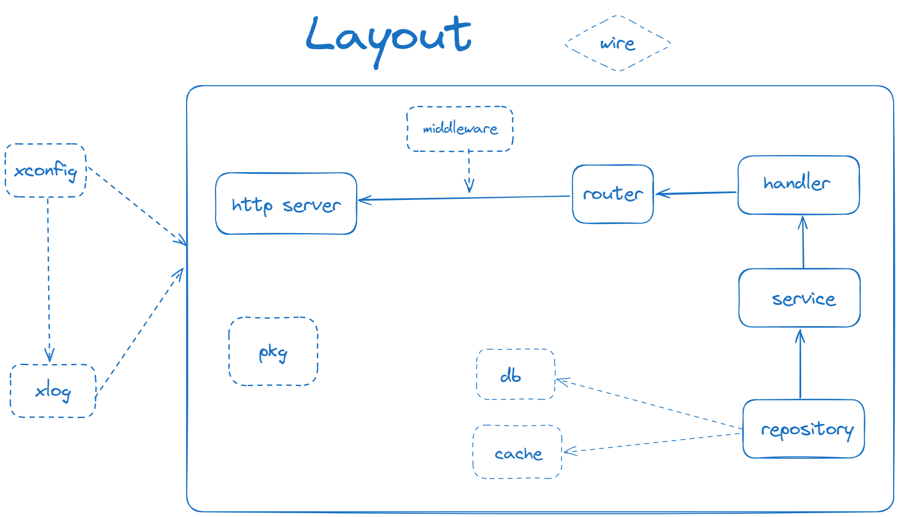
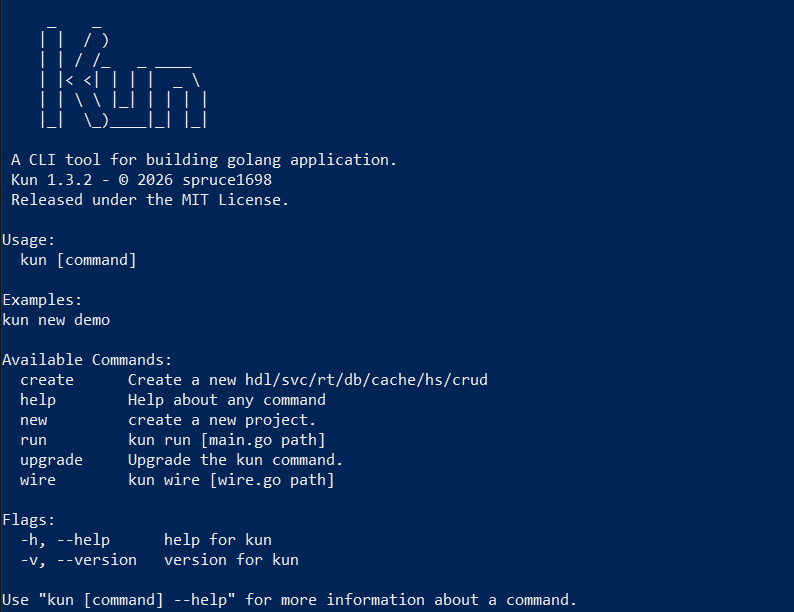

# kun — A CLI tool for building go applications.

### 地势坤，君子以厚德载物

kun(坤)是一个基于Golang的应用脚手架，由Golang生态中各种非常流行的库整合而成的，它们的组合可以帮助你快速构建一个高效、可靠的应用程序。

> [!TIP]
> **💡 规范变更**
>
> 1.3.0 之前用的是 controller 层命名，现在统一改为 handler，注意区分

## 功能

- **Gin**: https://github.com/gin-gonic/gin
- **Gorm**: https://github.com/go-gorm/gorm
- **Wire**: https://github.com/google/wire
- **Viper**: https://github.com/spf13/viper
- **Zap**: https://github.com/uber-go/zap
- **Golang-jwt**: https://github.com/golang-jwt/jwt
- **Go-redis**: https://github.com/go-redis/redis
- **Swaggo**:  https://github.com/swaggo/swag
- More...

## 特性

* **超低学习成本和定制**：kun封装了Gopher最熟悉的一些流行库。您可以轻松定制应用程序以满足特定需求。
* **高性能和可扩展性**：kun旨在具有高性能和可扩展性。它使用最新的技术和最佳实践，确保您的应用程序可以处理高流量和大量数据。
* **模块化和可扩展**：kun旨在具有模块化和可扩展性。您可以通过使用第三方库或编写自己的模块轻松添加新功能和功能。

## 简洁分层架构

kun采用了经典的分层架构。同时，为了更好地实现模块化和解耦，采用了依赖注入框架 `Wire`。



## kun CLI



## 目录结构

```
.
├── cmd
│      ├── server
│      │      ├── main.go
│      │      └── wire
│      │           ├── app.go
│      │           ├── wire.go
│      │           └── wire_gen.go
├── config
│      └─ local.yml
├── internal
│      ├── global
│      │      └──constant.go
│      ├── handler
│      │      └── serverDI.go
│      ├── middleware
│      │      ├── auth.go
│      │      ├── cors.go
│      │      ├── metrics.go
│      │      ├── ratelimit.go
│      │      └── recovery.go
│      ├── repository
│      │      ├── cache
│      │      │    ├── keys.go
│      │      │    └── local.go
│      │      ├── db
│      │      │    └── mysql.go
│      │      └── serverDI.go
│      ├── router
│      │      ├── v0
│      │      ├── router.go
│      │      └── serverDI.go
│      └── service
│             ├── svc
│             │    └──  context.go
│             └── serverDI.go
├── pkg
├── README.md
├── go.mod
└── go.sum
```

该项目的架构采用了典型的分层架构，主要包括以下几个模块：

- cmd: 应用程序的主要入口。
  - server: HTTP 服务的入口，包含主函数和依赖注入的代码。
    - main.go: 主函数，用于启动应用 HTTP 服务。
    - wire: Wire 依赖注入与应用装配代码。
      - app.go: HTTP 应用装配（Gin 模式设置、中间件加载、路由装配与资源优雅关闭回收）。
      - wire.go: 声明 Server 全栈分层依赖注入规则。
      - wire_gen.go: 使用 Wire 库自动生成的依赖注入代码。
- config: 应用程序的配置文件。
  - local.yml: 本地环境的配置文件。
- internal: 应用程序的内部核心业务代码。
  - global: 全局常量与枚举代码。
    - constant.go: 上下文 Key 常量与全局常量定义。
  - handler: HTTP 处理器层（参数校验、调用 Service）。
    - serverDI.go: Wire DI 注册所有 Handler 处理器依赖。
  - middleware: HTTP 中间件代码。
    - auth.go: JWT 授权中间件。
    - cors.go: 跨域资源共享中间件。
    - metrics.go: Prometheus 监控指标收集中间件。
    - ratelimit.go: 请求限流中间件（支持单机与 Redis 分布式滑动窗口限流）。
    - recovery.go: 接管默认恢复中间件，Panic 异常捕获。
  - repository: 存储与数据访问层代码。
    - cache: 缓存存储代码。
      - keys.go: 缓存 Keys 统一管理文件。
      - local.go: 本地内存缓存操作文件。
    - db: 数据库访问层代码。
      - mysql.go: MySQL 通用连接与查询接口。
    - serverDI.go: Wire DI 注册所有 Repository 依赖。
  - router: 路由代码。
    - v0: 默认第一个/公共版本路由。
    - router.go: 全局通用路由（404 处理、健康检查、Metrics 等）。
    - serverDI.go: Wire DI 注册所有路由定义依赖。
  - service: 业务服务（逻辑）代码。
    - svc: 业务服务核心目录。
      - context.go: 业务逻辑基础上下文（配置、DB、Redis 等公共组件）。
    - serverDI.go: Wire DI 注册服务层依赖。
- pkg: 应用程序的跨项目公共工具包（加解密、JWT、网络、配置、日志等）。
- README.md: 项目说明文档。
- go.mod: Go 模块依赖定义文件。
- go.sum: Go 模块依赖版本校验文件。

此外，还包含了一些其他的文件和目录，如授权文件、构建文件、README等。整体上，该项目的架构清晰，各个模块之间的职责明确，便于理解和维护。

## 要求

要使用kun，您需要在系统上安装以下软件：

* Golang `1.25.11`或更高版本
* Git
* Docker (可选)
* MySQL5.7或更高版本(可选)
* Redis（可选）

### 安装

您可以通过以下命令安装kun：

```bash
go install github.com/sprucepeak/kun@latest
```

国内用户可以使用 `GOPROXY`加速 `go install`

```bash
go env -w GO111MODULE=on
go env -w GOPROXY=https://goproxy.cn,direct
```

> tips: 如果 `go install`成功，却提示找不到kun命令，这是因为环境变量没有配置，可以把 GOBIN 目录配置到环境变量中即可

### 数据库驱动说明

kun 默认只编译 **MySQL** 和 **PostgreSQL** 驱动，支持 `CGO_ENABLED=0` 纯静态构建，可直接用于 Docker 镜像。

| 驱动       | 默认包含 | 启用方式                  | 备注         |
| ---------- | -------- | ------------------------- | ------------ |
| MySQL      | ✅       | 默认                      | 无 CGO 依赖  |
| PostgreSQL | ✅       | 默认                      | 无 CGO 依赖  |
| SQLite     | ❌       | `-tags with_sqlite`     | 需要 CGO     |
| ClickHouse | ❌       | `-tags with_clickhouse` | SDK 体积较大 |

**默认安装（推荐，静态构建）：**

```bash
go install github.com/sprucepeak/kun@latest
```

**包含全部驱动（需要 CGO 环境）：**

```bash
go install -tags "with_sqlite with_clickhouse" github.com/sprucepeak/kun@latest
```

**本地构建时指定驱动：**

```bash
# 仅 MySQL + Postgres（默认，CGO_ENABLED=0 可用）
go build -o kun .

# 含 SQLite
go build -tags with_sqlite -o kun .

# 含全部驱动
go build -tags "with_sqlite with_clickhouse" -o kun .
```

### 创建新项目

您可以使用以下命令创建一个新的Golang项目：

```bash
// 推荐新用户选择 Advanced Layout
kun new projectName
```

`kun new` 可以通过git拉起远程模板

```
// 使用
kun new projectName -g https://github.com/xxx.git
```

> kun内置了两种类型的Layout：

* **基础模板(Basic Layout)**

Basic Layout 包含一个非常精简的架构目录结构，适合非常熟悉kun项目的开发者使用。

* **高级模板(Advanced Layout)**

**建议：我们推荐新手优先选择使用Advanced Layout。**

Advanced Layout 包含了很多kun的用法示例（ db、redis、 jwt、 cron、 migration等），适合开发者快速学习了解kun的架构思想。

此命令将创建一个名为 `projectName`的目录，并在其中生成一个优雅的Golang项目结构。

### 创建组件

您可以使用以下命令为项目创建router、handler、service、repository/db和repository/cache等组件：

```bash
kun create rt user
kun create hdl user
kun create svc user
kun create db "name:pwd@tcp(127.0.0.1:3306)/dbname" "[t1,t2|t1|*]" 
kun create db "*.sql" "[t1,t2|*]"
kun create cache cache
kun create crud user # 一键生成 router、service 与 handler
```

或

```bash
kun create hs user # 一键生成 handler 与 service
```

这些命令将分别创建对应的组件文件，并自动挂载到相应的 Wire DI 依赖项与目录结构中。

> [!TIP]
> **💡 业务代码占位规范：关于 `// TODO: add` 标识**
>
> 自动生成的各个组件文件中均统一内置了格式为 `// TODO: add ... and delete this line` 的待办标识：
>
> - **全局一键检索**：开发者在 IDE 中只需全局搜索 `// TODO: add`，即可一站式定位所有需要填充核心业务逻辑、路由注册、查询过滤条件或结构体扩展的位置。
> - **开发避坑提醒**：**在尚未实际添加对应的业务实现代码前，请不要轻易删除该标识行**，避免在多人协作或后续开发中遗漏关键实现；当具体逻辑代码编写完成后，再按提示删除该行注释即可。

### 启动项目

您可以使用以下命令快速启动项目：[README.md](tpl/advanced/README.md)

```bash
kun run
```

此命令将启动您的Golang项目。

### 编译wire.go

您可以使用以下命令快速编译 `wire.go`：

```bash
kun wire
```

此命令将编译您的 `wire.go`文件，并生成所需的依赖项。

## 贡献

如果您发现任何问题或有任何改进意见，请随时提出问题或提交拉取请求。我们非常欢迎您的贡献！

## 许可证

kun是根据MIT许可证发布的。有关更多信息，请参见[LICENSE](LICENSE)文件。

## 鸣谢

此项目是参考 [nunu](https://github.com/go-nunu/nunu) 根据个人经验 优化而来 各位看官自行选择。感谢 nunu 提供的思路
