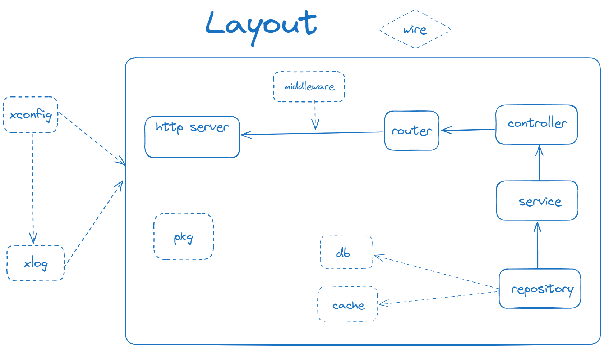

# kun — A CLI tool for building go applications.

### 地势坤，君子以厚德载物

kun(坤)是一个基于Golang的应用脚手架，由Golang生态中各种非常流行的库整合而成的，它们的组合可以帮助你快速构建一个高效、可靠的应用程序。

## 文档 TODO

## 功能

- **Gin**: https://github.com/gin-gonic/gin
- **Gorm**: https://github.com/go-gorm/gorm
- **Wire**: https://github.com/google/wire
- **Viper**: https://github.com/spf13/viper
- **Zap**: https://github.com/uber-go/zap
- **Golang-jwt**: https://github.com/golang-jwt/jwt
- **Go-redis**: https://github.com/go-redis/redis
- **Swaggo**:  https://github.com/swaggo/swag
- More...

## 特性

* **超低学习成本和定制**：kun封装了Gopher最熟悉的一些流行库。您可以轻松定制应用程序以满足特定需求。
* **高性能和可扩展性**：kun旨在具有高性能和可扩展性。它使用最新的技术和最佳实践，确保您的应用程序可以处理高流量和大量数据。
* **模块化和可扩展**：kun旨在具有模块化和可扩展性。您可以通过使用第三方库或编写自己的模块轻松添加新功能和功能。

## 简洁分层架构

kun采用了经典的分层架构。同时，为了更好地实现模块化和解耦，采用了依赖注入框架 `Wire`。



## kun CLI


## 目录结构

```
.
├── cmd
│   ├── server
│   │   ├── main.go
│   │   ├── wire
│   │   │   ├── wire.go
│   │   │   └── wire_gen.go
│   ├── broker
│   │   ├── main.go
│   │   ├── wire
│   │   │   ├── wire.go
│   │   │   └── wire_gen.go
├── config
│   ├── dev.yml
├── deploy
│   ├── ci
│   │   ├── docker-compose.yml
│   ├── docker
│   │   ├── Dockerfile
├── docs
│   ├── swagger
├── internal
│   ├── controller
│   │   └──demo.go
│   ├── global
│   │   └──router.go
│   ├── logic
│   │   ├── demo.go
│   │   └── logic.go
│   ├── middleware
│   │   ├── cors.go
│   │   ├── logger.go
│   │   └── recovery.go
│   ├── pubsub
│   │   ├── publisher.go
│   │   ├── subscriber.go
│   ├── repository
│   │   ├── cache
│   │   │   ├── demo.go
│   │   ├── mysql
│   │   │   ├── mysql.go
│   │   │   ├── demo.go
│   │   │   └── demo_gen.go
│   └── router
│       ├── router.go
│   │   │   ├── v0
│   │   │   │   └──  demo.go
├── pkg
├── scripts
│   ├── swagger.sh
├── test
├── README.md
├── go.mod
└── go.sum

```

该项目的架构采用了典型的分层架构，主要包括以下几个模块：

- cmd: 应用程序的主要入口。
  - server: http服务的入口，包含主函数和依赖注入的代码。
    - main.go: 主函数，用于启动应用http服务。
    - wire: 存放依赖注入代码
      - wire.go: 使用Wire库生成的依赖注入代码。
      - wire_gen.go: 使用Wire库生成的依赖注入代码。
  - broker: 发布/订阅服务器的入口，包含主函数和依赖注入的代码。
    - main.go: 主函数，用于启动发布/订阅服务器。
    - wire: 存放依赖注入代码
      - wire.go: 使用Wire库生成的依赖注入代码。
      - wire_gen.go: 使用Wire库生成的依赖注入代码。

- config: 存放应用程序的配置文件。
  - local.yml: 本地环境的配置文件。

- deploy: 部署。
  - ci: ci目录。
  - docker: docker编译文件。

- docs: 
  - swagger: Swaggo生成的接口文档。

- internal: 存放应用程序的内部代码。
  - controller: 处理HTTP请求的控制器。
    - demo.go: 处理demo相关的HTTP请求的控制器。
  - global: 存放常量/全局变量代码。
    - ctx.go: ctx中的常量/全局变量。
    - router.go: 路由常量/全局变量。
  - logic: 存放业务逻辑代码。
    - logic.go: 业务逻辑的通用接口。
    - demo.go: demo业务逻辑的实现。
  - middleware: 存放中间件代码。
    - cors.go: 跨域资源共享中间件。
    - logger.go: 接管默认日志中间件。
    - recovery.go: 接管默认恢复中间件。
  - pubsub: 消息发布/订阅。
    - publisher.go: 消息发布器。
    - subscriber.go: 消息订阅器。
  - repository: 存储库相关代码。
    - mysql: 存放mysql数据库代码
      - mysql.go: mysql通用接口。
      - demo.go: demo数据访问接口的实现自定义。
      - demo_gen.go: demo数据访问接口的实现系统生成。
  - router: 存放路由代码。
    - router.go: 通用路由。
    - v0: 默认第一个/公共版本。
      - demo.go: demo相关路由。
- pkg: 存放应用程序的公共包。
- scripts:  项目脚本。
  - swagger.sh: 生成swagger文档的脚本。
- test: mock代码
- go.mod: Go模块文件。
- go.sum: Go模块的依赖版本文件。

此外，还包含了一些其他的文件和目录，如授权文件、构建文件、README等。整体上，该项目的架构清晰，各个模块之间的职责明确，便于理解和维护。

## 要求

要使用kun，您需要在系统上安装以下软件：

* Golang 1.19或更高版本
* Git
* Docker (可选)
* MySQL5.7或更高版本(可选)
* Redis（可选）

### 安装

您可以通过以下命令安装kun：

```bash
go install github.com/spruce1698/kun@latest
```

国内用户可以使用 `GOPROXY`加速 `go install`

```
$ go env -w GO111MODULE=on
$ go env -w GOPROXY=https://goproxy.cn,direct
```

> tips: 如果 `go install`成功，却提示找不到kun命令，这是因为环境变量没有配置，可以把 GOBIN 目录配置到环境变量中即可

### 创建新项目

您可以使用以下命令创建一个新的Golang项目：

```bash
// 推荐新用户选择 Advanced Layout
kun new projectName
```

`kun new` 可以通过git拉起远程模板

```
// 使用
kun new projectName -g https://github.com/xxx.git

```

> kun内置了两种类型的Layout：

* **基础模板(Basic Layout)**

Basic Layout 包含一个非常精简的架构目录结构，适合非常熟悉kun项目的开发者使用。

* **高级模板(Advanced Layout)**

**建议：我们推荐新手优先选择使用Advanced Layout。**

Advanced Layout 包含了很多kun的用法示例（ db、redis、 jwt、 cron、 migration等），适合开发者快速学习了解kun的架构思想。

此命令将创建一个名为 `projectName`的目录，并在其中生成一个优雅的Golang项目结构。

### 创建组件

您可以使用以下命令为项目创建controller、logic和repository等组件：

```bash
kun create ctl user
kun create logic user
kun create repo "name:pwd@tcp(127.0.0.1:3306)/dbname" [t1,t2|t1|*]
```

或

```
kun create all user
```

这些命令将分别创建以`UserCtl` 和 `UserLogic` 命名的组件，并将它们放置在正确的目录中。

### 启动项目

您可以使用以下命令快速启动项目：

```bash
kun run
```

此命令将启动您的Golang项目。

### 编译wire.go

您可以使用以下命令快速编译 `wire.go`：

```bash
kun wire
```

此命令将编译您的 `wire.go`文件，并生成所需的依赖项。

## 贡献

如果您发现任何问题或有任何改进意见，请随时提出问题或提交拉取请求。我们非常欢迎您的贡献！

## 许可证

kun是根据MIT许可证发布的。有关更多信息，请参见[LICENSE](LICENSE)文件。

## 鸣谢

此项目是参考 [nunu](https://github.com/go-nunu/nunu) 根据个人经验 优化而来 各位看官自行选择。感谢 nunu 提供的思路
